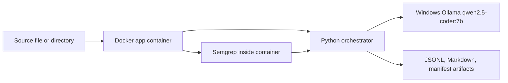

# Vulnerability Discovery Agent

This repository implements a reproducible Python security-analysis workflow that compares Semgrep, local LLM analysis, Semgrep-gated analysis, and a hybrid workflow using Semgrep evidence plus source-code reasoning. The project uses Docker for the application runtime, Semgrep inside the container, and a local Windows-host Ollama service running `qwen2.5-coder:7b`.

## Research Question

Can a local open-source LLM improve the usefulness and trustworthiness of static-analysis vulnerability discovery while preserving raw evidence, structured outputs, and reproducible evaluation artifacts?

## Main Contributions

- A typed Python package under `src/vuln_agent`.
- Four comparable modes: `semgrep`, `llm`, `semgrep_gated`, and `hybrid`.
- Docker-based reproducibility with Semgrep in the application image.
- Structured Pydantic output validation and explicit error rows.
- Frozen Week 4, Week 5, and post-Week-5 artifacts for auditability.
- Final documentation, demo scripts, and acceptance checklist for Week 6.

## System Architecture



## Supported Modes

- `semgrep`: tool-only decision from Semgrep findings.
- `llm`: full source file is sent to the local LLM without Semgrep gating.
- `semgrep_gated`: Semgrep runs first; the LLM only analyzes cases where Semgrep reports at least one finding.
- `hybrid`: Semgrep findings are supplied as evidence while the source code is also available to the reasoning workflow. Absence of a Semgrep finding is not intended to be treated as proof of safety in the benchmark hybrid implementation.

The hardened scanner is a post-Week-6 engineering revision. Frozen benchmark metrics remain tied to their frozen implementations and evaluation sets.

User scans report grouped findings and user-facing classifications such as `VULNERABLE`, `LIKELY_VULNERABLE`, `REJECTED`, `UNCERTAIN`, and `ERROR`; they do not claim benchmark TP/FP ground truth for arbitrary files. Model confidence is uncalibrated model-reported confidence.

## Technology Stack

Python 3.10, Pydantic, Requests, PyYAML, Pytest, Docker, Semgrep, Ollama, and `qwen2.5-coder:7b`.

## Prerequisites

- Docker Desktop
- Windows Ollama running locally
- Ollama model: `qwen2.5-coder:7b`
- PowerShell for the primary Windows commands

Install the model on the Windows host:

```powershell
ollama pull qwen2.5-coder:7b
```

Recommended environment variables are documented in `.env.example`:

```text
OLLAMA_BASE_URL=http://host.docker.internal:11434
OLLAMA_MODEL=qwen2.5-coder:7b
OLLAMA_NUM_CTX=2048
```

## Docker Quick Start

Run from the repository root:

```powershell
docker compose build app
docker compose run --rm app doctor
```

Linux/macOS equivalent, when Docker can resolve the host Ollama endpoint:

```sh
docker compose build app
docker compose run --rm app doctor
```

## Single-File Or Directory Scan

Directory scan:

```powershell
docker run --rm -v "${PWD}:/work" -w /work --user root `
  -e OLLAMA_BASE_URL=http://host.docker.internal:11434 `
  -e OLLAMA_MODEL=qwen2.5-coder:7b `
  cybersecurity-agent-app:latest scan examples/vulnerable_app `
  --mode hybrid --save-raw --max-files 10 `
  --output-dir artifacts/reports/demo_vulnerable
```

The CLI accepts either a file or a directory path.

## Output Schema Example

Scan outputs are written as JSONL/Markdown plus a manifest. Final findings include fields such as:

```json
{
  "status": "ACCEPTED",
  "analyzer_verdict": "TP",
  "confidence": 0.75,
  "normalized_cwe": "CWE-078",
  "source_evidence": "...",
  "sink_evidence": "...",
  "remediation": "..."
}
```

## Evaluation Reproduction

Do not overwrite frozen artifacts. New smoke/evaluation runs should write to a new artifact directory.

```powershell
docker run --rm --entrypoint python -v "${PWD}:/work" -w /work --user root `
  cybersecurity-agent-app:latest -m vuln_agent.post_week5 finalize `
  --artifact artifacts/improvements/20260721T091131Z-post-week5
```

## Final Results

Frozen Week 4 60-case results:

| Mode | Precision | Recall | F1 | Accuracy |
| --- | ---: | ---: | ---: | ---: |
| Semgrep | 0.600 | 0.200 | 0.300 | 0.533 |
| LLM | 0.519 | 0.900 | 0.659 | 0.533 |
| Semgrep-gated | 0.600 | 0.200 | 0.300 | 0.533 |
| Hybrid | 0.600 | 0.400 | 0.480 | 0.567 |

Post-Week-5 40-case held-out results:

| Configuration | Precision | Recall | F1 | FPR | Accuracy |
| --- | ---: | ---: | ---: | ---: | ---: |
| LLM | 0.559 | 0.950 | 0.704 | 0.750 | 0.600 |
| Evidence-first LLM repair | 1.000 | 0.050 | 0.095 | 0.000 | 0.486 |
| Original hybrid | 0.588 | 0.500 | 0.541 | 0.350 | 0.575 |
| Improved hybrid | 0.000 | 0.000 | 0.000 | 0.000 | 0.591 |

The post-Week-5 improvement attempt reduced false positives but collapsed recall, introduced schema failures/timeouts, and was rejected as an operational replacement.

## Week 5 Trustworthiness Findings

Week 5 found Semgrep rule coverage gaps, gate-blocked vulnerable cases, LLM overprediction, LLM underprediction, CWE mapping errors, unsupported evidence, schema fragility in prompt variants, and a large human-review queue.

## Limitations

- Benchmark samples are small and should not be overgeneralized.
- Local model behavior depends on hardware and Ollama runtime conditions.
- The project does not fine-tune models.
- The system does not provide full vulnerability coverage or production deployment controls.
- High-impact findings require human review.

## Responsible Use

Use this project to support defensive review, benchmarking, and research. Do not treat model output as a final security decision without human verification.

## Repository Structure

- `src/vuln_agent/`: supported package and authoritative runtime
- `configs/`: YAML configuration
- `examples/`: demo targets
- `docs/`: architecture, final evaluation, demo, recommendations
- `tests/`: unit and integration tests
- `artifacts/`: generated and frozen evidence, ignored by Git
- `scripts/`: Week 6 demo scripts

Historical root-level modules such as `agents/`, `llm/`, `logger/`, `tools/`, `schemas/`, `pipeline.py`, and `scan.py` are legacy research material unless explicitly imported by `src/vuln_agent/`. They are not the supported scanner runtime.

## Submission Packaging

Create a clean source archive after committing/tagging:

```powershell
.\scripts\create_submission_archives.ps1 -Ref week6-final-complete
```

Use `-EvidenceArtifact artifacts/final/20260721T143559Z-week6-final` to create a separate evidence archive. Generated ZIP files are ignored.

## Troubleshooting

- If Docker cannot reach Ollama, confirm Windows Ollama is running and use `http://host.docker.internal:11434`.
- If the model is missing, run `ollama pull qwen2.5-coder:7b`.
- If Semgrep is missing locally, use Docker; Semgrep is installed inside the app image.
- If output directories are unwritable, run commands from the repository root and use repository-relative paths.

## Detailed Documentation

- [Architecture](docs/architecture.md)
- [Final Evaluation Report](docs/final_evaluation_report.md)
- [Recommendations](docs/recommendations.md)
- [Demo Guide](docs/demo.md)
- [Demo Script](docs/demo_script.md)
