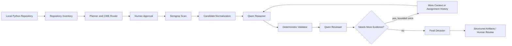

# Bounded Agentic Vulnerability-Discovery Workflow

This repository contains a bounded, local vulnerability-discovery workflow for Python repositories. The completed Plan B v2 MVP performs static repository inventory, routes analysis to supported CWEs, generates candidates with Semgrep, reasons with Qwen2.5-Coder 7B through Ollama, applies deterministic validation, runs isolated reasoner and reviewer roles, includes human checkpoints, enforces bounded execution, writes structured audit artifacts, and treats target repositories as read-only.

The final Agentic v2 demonstration was verified locally on Windows using a Python virtual environment, Semgrep, Ollama, and `qwen2.5-coder:7b`. Docker files remain for the broader repository, earlier evaluation workflow, and optional packaging; Docker was not used for the final verified Agentic v2 run.

## Demo Video

ADD_YOUTUBE_LINK_HERE

## Research Question

Can a bounded local agentic workflow improve the auditability and usefulness of Python vulnerability discovery by combining deterministic routing, Semgrep candidate generation, isolated local-model reasoning and review, deterministic validation, human checkpoints, and reproducible artifacts?

## Main Contributions

- Adaptive repository inventory and routing for `CWE-078` and `CWE-089`.
- Semgrep-based candidate generation with normalized bounded candidates.
- Isolated Qwen reasoner and reviewer roles using fresh context per call.
- Deterministic validator reuse so failed safety checks cannot be overridden by an LLM.
- Strict structured-output schemas with one bounded repair attempt.
- Human approval before scanning and human escalation for unresolved findings.
- Bounded steps, retries, evidence passes, candidate count, and LLM calls.
- Six structured artifacts for each Agentic v2 run.
- Preserved Plan B v1 benchmark baseline and historical evaluation evidence.

## System Architecture



## Final Plan B v2 Bounded Agentic MVP

Plan B v2 extends the frozen Plan B v1 workflow with a deterministic agentic control layer. It does not change the frozen v1 detector, Semgrep rules, prompts, validators, Hybrid logic, model configuration, thresholds, or evaluation artifacts.

One open-source local LLM is used sequentially in isolated reasoner and reviewer roles. A deterministic orchestrator controls planning, routing, tools, validation, safety, memory, and stopping conditions.

The workflow is:

1. Inspect a local Python repository without importing or executing target code.
2. Activate `CWE-078` when shell indicators exist and `CWE-089` when SQL/database indicators exist.
3. Ask for human scan-plan approval, unless `--auto-approve` is supplied.
4. Run the existing Semgrep wrapper on the selected local target.
5. Normalize Semgrep results into at most 20 candidates.
6. Extract bounded same-file context for each candidate.
7. Run the isolated reasoner role.
8. Apply deterministic validation for source, sink, line validity, CWE/sink compatibility, flow plausibility, constant overwrite, SQL parameterization, and safe shell usage.
9. Run the isolated reviewer role using only reasoner output, validator result, and collected evidence.
10. Allow one additional evidence pass for more local context or AST assignment history.
11. Map results to terminal states: `CONFIRMED`, `REJECTED`, `HUMAN_REVIEW_REQUIRED`, `TOOL_ERROR`, or `OUT_OF_SCOPE`.
12. Write a reproducible artifact trail.

Safety policy: Plan B v2 accepts local repository paths only, resolves paths inside the supplied target, keeps target files read-only, does not install target dependencies, does not run target tests, does not start target applications, and does not clone GitHub URLs.

## Verified Project State

| Item | Verified value |
| --- | --- |
| Branch | `plan-b-v2-agentic` |
| Commit | `8a3b27053d92d3e15ed1dd0a259d50f22e154cc8` |
| Semgrep | `1.171.0` |
| Model | `qwen2.5-coder:7b` |
| Tests | `218 passed, 2 skipped` |
| Git status after verification | clean |

## Agentic v2 CLI Examples

Verified vulnerable CWE-089 fixture:

```powershell
.\.venv\Scripts\python.exe scripts\run_agentic_v2.py `
  --repository tests\fixtures\agentic_v2\cwe089_vulnerable `
  --cwes CWE-078 CWE-089 `
  --auto-approve `
  --auto-review-policy keep
```

Verified safe parameterized CWE-089 fixture:

```powershell
.\.venv\Scripts\python.exe scripts\run_agentic_v2.py `
  --repository tests\fixtures\agentic_v2\cwe089_parameterized `
  --cwes CWE-078 CWE-089 `
  --auto-approve `
  --auto-review-policy keep
```

Each run writes artifacts under `artifacts/agentic-runs/<run-id>/`.

## Generated Artifacts

| Artifact | Purpose |
| --- | --- |
| `run_manifest.json` | Records run ID, repository path, requested CWEs, review policy, and start metadata. |
| `scan_plan.json` | Records inventory, active routes, skipped routes, candidate budget, and safety policy. |
| `events.jsonl` | Append-only event trace for inventory, approval, Semgrep, model calls, validation, review, terminal decisions, and human review. |
| `findings.json` | Stores normalized Semgrep candidates before final decision reporting. |
| `state.json` | Stores current run state, budget use, terminal decisions, and intermediate decision data. |
| `final_report.json` | Stores final findings, terminal outcomes, human-review decisions, and run summary. |

## Technology Stack

| Technology | Role |
| --- | --- |
| Python virtual environment | Final verified local runtime for Agentic v2. |
| Semgrep | Static candidate generation for supported Python vulnerability patterns. |
| Ollama | Local model server used by Agentic v2. |
| `qwen2.5-coder:7b` | Local open-source model used sequentially as reasoner and reviewer. |
| Pydantic | Strict structured schemas for model outputs and artifacts. |
| Pytest | Unit and focused behavioral verification. |
| Git | Baseline, branch, and clean-state verification. |
| Docker | Earlier evaluation workflow and optional packaging support for the broader repository. |
| React/Vite frontend | Repository UI surface; not the deployed final Agentic v2 demonstration. |

## Prerequisites

- Windows PowerShell.
- Python virtual environment at `.\.venv`.
- Semgrep available in the project environment.
- Ollama running locally.
- Ollama model `qwen2.5-coder:7b`.
- Git.

Check the local model:

```powershell
ollama list
```

Check Semgrep:

```powershell
.\.venv\Scripts\semgrep.exe --version
```

## Optional Docker Workflow

Docker remains available for earlier evaluation and broader repository support. It was not used for the final verified Agentic v2 demonstration.

```powershell
docker compose build app
docker compose run --rm app doctor
```

## Earlier Scanner Workflow

The earlier scanner supports file or directory input and modes such as `semgrep`, `llm`, `semgrep_gated`, and `hybrid`. These modes belong to the Plan B v1 and earlier evaluation workflow.

```powershell
docker run --rm -v "${PWD}:/work" -w /work --user root `
  -e OLLAMA_BASE_URL=http://host.docker.internal:11434 `
  -e OLLAMA_MODEL=qwen2.5-coder:7b `
  cybersecurity-agent-app:latest scan examples/vulnerable_app `
  --mode hybrid --save-raw --max-files 10 `
  --output-dir artifacts/reports/demo_vulnerable
```

Agentic v2 final decisions use terminal states such as:

```json
{
  "terminal_state": "CONFIRMED",
  "confidence": 1.0
}
```

## Final Verified Agentic v2 Results

| Test case | Candidates | LLM calls | Final result |
| --- | ---: | ---: | --- |
| Safe parameterized SQL | 0 | 0 | No vulnerability reported |
| Vulnerable SQL query | 1 | 2 | CONFIRMED |

The safe case produced no candidate and no LLM call. The vulnerable case passed through the reasoner, validator, and reviewer, reached final terminal state `CONFIRMED`, and reported confidence `1.0`. This proves end-to-end MVP behavior, not large-scale Agentic v2 benchmark performance.

## Earlier Quantitative Evaluation

These are frozen Plan B v1 / earlier evaluation results. The historical metrics below are preserved exactly.

Frozen Week 4 60-case results:

| Mode | Precision | Recall | F1 | Accuracy |
| --- | ---: | ---: | ---: | ---: |
| Semgrep | 0.600 | 0.200 | 0.300 | 0.533 |
| LLM | 0.519 | 0.900 | 0.659 | 0.533 |
| Semgrep-gated | 0.600 | 0.200 | 0.300 | 0.533 |
| Hybrid | 0.600 | 0.400 | 0.480 | 0.567 |

Post-Week-5 40-case held-out results:

| Configuration | Precision | Recall | F1 | FPR | Accuracy |
| --- | ---: | ---: | ---: | ---: | ---: |
| LLM | 0.559 | 0.950 | 0.704 | 0.750 | 0.600 |
| Evidence-first LLM repair | 1.000 | 0.050 | 0.095 | 0.000 | 0.486 |
| Original hybrid | 0.588 | 0.500 | 0.541 | 0.350 | 0.575 |
| Improved hybrid | 0.000 | 0.000 | 0.000 | 0.000 | 0.591 |

The post-Week-5 improvement attempt reduced false positives but collapsed recall, introduced schema failures/timeouts, and was rejected as an operational replacement.

## Earlier Trustworthiness and Failure Analysis

Week 5 found Semgrep rule coverage gaps, gate-blocked vulnerable cases, LLM overprediction, LLM underprediction, CWE mapping errors, unsupported evidence, schema fragility in prompt variants, and a large human-review queue.

## Limitations

- Local Python repositories only.
- Routing is limited to `CWE-078` and `CWE-089`.
- Live demonstration was mainly verified for `CWE-089`.
- Evidence collection is bounded and primarily same-file.
- No full interprocedural call graph.
- Controlled demo cases, not a large external Agentic v2 benchmark.
- Local model behavior can vary across hardware, runtime state, and prompt sensitivity.
- No automatic remediation.
- No deployed web interface for the final Agentic v2 demonstration.
- Uncertain or high-impact findings require human review.

## Responsible Use

Use this project only for academic study, internship evaluation, defensive security research, and authorized analysis of systems you are permitted to inspect. Treat model output as decision support, not as a final security determination without human review.

## Repository Structure

- `src/vuln_agent/`: supported runtime package, including scanner, validation, web API support, and Agentic v2 modules.
- `scripts/`: command-line and project-support scripts, including `scripts/run_agentic_v2.py`.
- `tests/`: unit tests and controlled fixtures, including `tests/fixtures/agentic_v2/`.
- `config/`: Agentic v2 configuration, including `config/agentic_v2.yaml`.
- `configs/`: earlier scanner and evaluation YAML configuration.
- `docs/`: project documentation, including final Agentic v2 documentation.
- `artifacts/`: generated run outputs and frozen evidence; generated contents are not intended for source commits.
- `frontend/`: React/Vite interface for the broader repository UI.
- `semgrep-rules/python/`: Python Semgrep rules used by the scanner.
- `Dockerfile` and `docker-compose.yml`: earlier evaluation and optional packaging support.
- Legacy root-level modules such as `agents/`, `llm/`, `logger/`, `tools/`, `schemas/`, `pipeline.py`, and `scan.py`: historical research material unless explicitly imported by `src/vuln_agent/`.

## Local Agentic v2 Troubleshooting

- If Semgrep is not found, verify `.\.venv\Scripts\semgrep.exe --version`.
- If the model is unavailable, confirm Ollama is running and `qwen2.5-coder:7b` appears in `ollama list`.
- If a scan produces no candidates, inspect `scan_plan.json` and `events.jsonl` to confirm routing, target path resolution, and Semgrep findings.
- If a model response fails schema validation, inspect the recorded events for repair attempts and terminal `TOOL_ERROR` details.
- If a repository path is rejected, ensure the path is local, resolves inside the supplied target, and does not rely on symlink escapes or traversal.
- If artifacts are missing, check `artifacts/agentic-runs/<run-id>/` for all six expected files.

## Detailed Documentation

- [Agentic v2 Architecture](docs/agentic_v2/ARCHITECTURE.md)
- [Agentic v2 Usage](docs/agentic_v2/USAGE.md)
- [Agentic v2 Evaluation](docs/agentic_v2/EVALUATION.md)
- [Agentic v2 Limitations](docs/agentic_v2/LIMITATIONS.md)
- [Final Evaluation Report](docs/final_evaluation_report.md)
- [Recommendations](docs/recommendations.md)

## Submission Materials

- GitHub repository.
- Final internship report.
- Architecture documentation.
- Preserved safe and vulnerable evidence.
- YouTube demo.

## Author

Your Full Name  
Internship Project  
Scientific Analysis Group  
Defence Research and Development Organisation  
Metcalfe House, Delhi, India  
Mentor: Dr. Pooja Yadav

## Disclaimer

This repository is provided for academic, internship, defensive-security, and authorized-use purposes. Do not use it to scan, test, exploit, or assess systems without explicit permission. The outputs are research evidence and decision support, not a substitute for professional security review.
