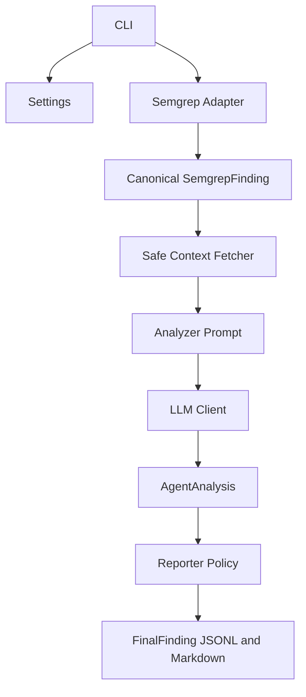

# Architecture

The current implementation is a bounded Semgrep -> context -> analyzer -> reporter workflow. It is intentionally conservative and records failures as errors or review items rather than silently treating them as safe code.
