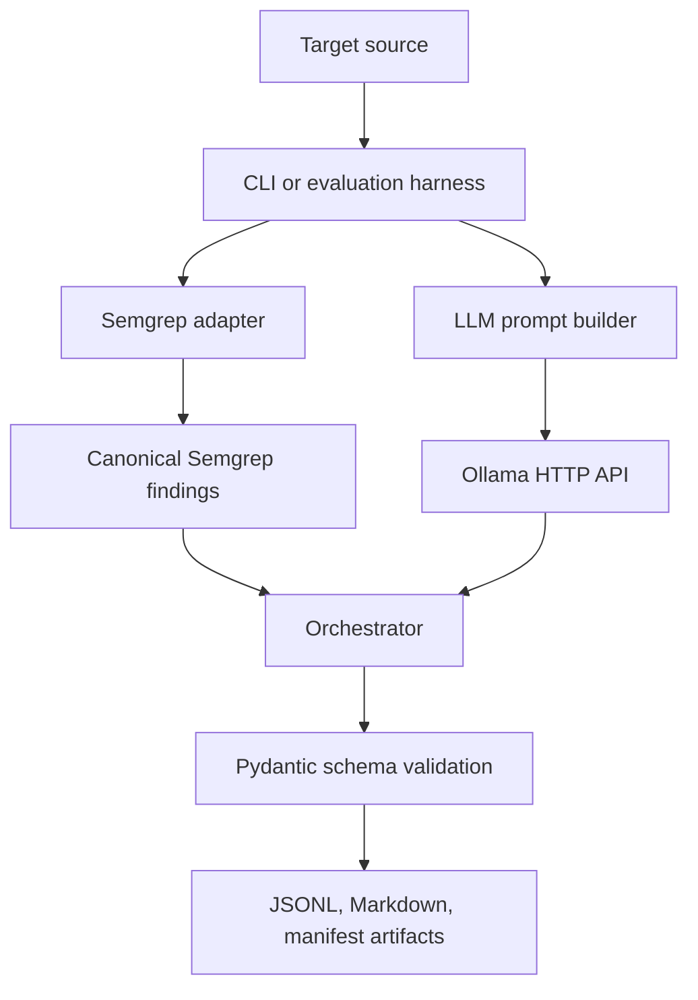
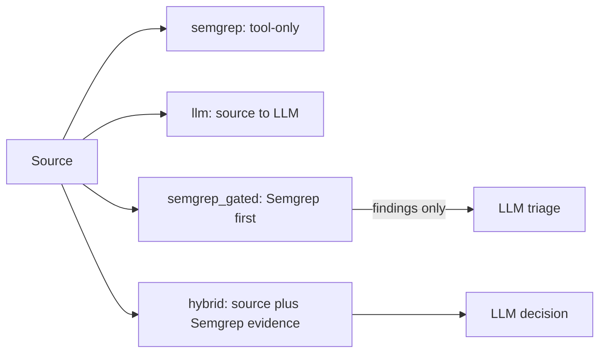
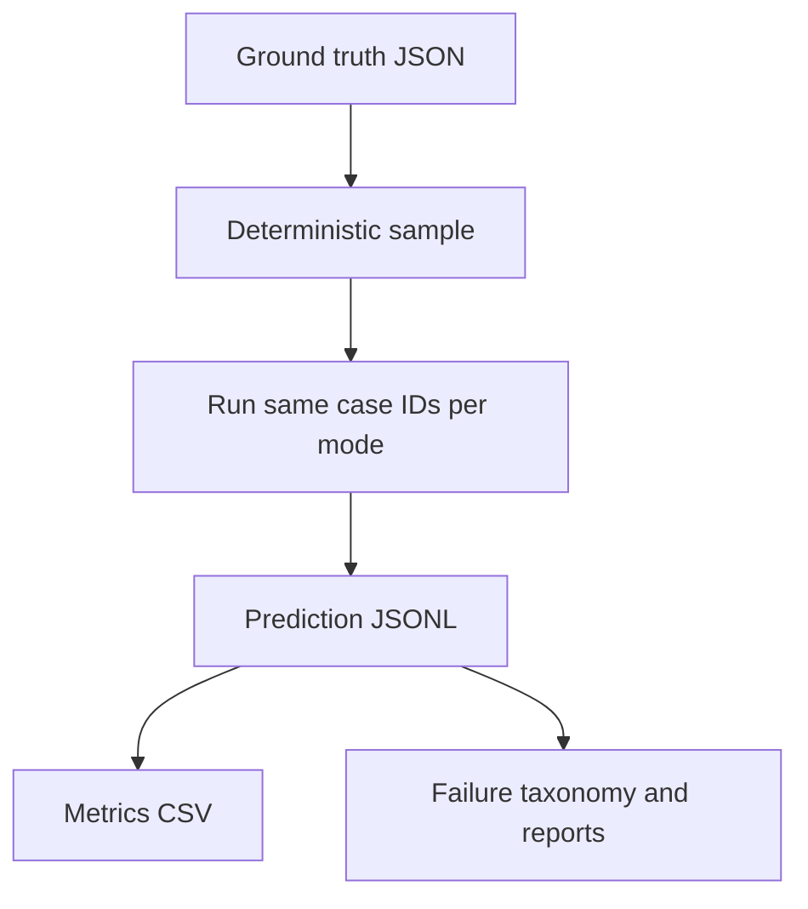
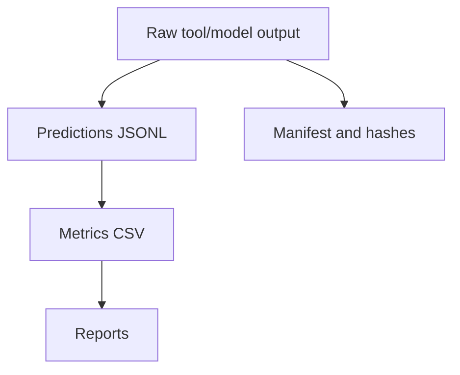

# Architecture

## Runtime Overview

The implemented system is a Python package running in a Docker application container. Semgrep is installed inside that container. LLM calls go to a Windows-host Ollama service at `http://host.docker.internal:11434` using `qwen2.5-coder:7b`.

## Mode Comparison

- `semgrep`: decides vulnerable when Semgrep reports findings.
- `llm`: sends source code to Ollama and validates structured JSON.
- `semgrep_gated`: only calls the LLM after Semgrep reports a finding.
- `hybrid`: supplies source plus Semgrep evidence to the benchmark reasoning workflow; Semgrep findings are evidence, not final proof.

## Evaluation Flow

## Artifact Flow

## Error Handling And Checkpoints

Tool errors, schema errors, and timeouts are recorded as explicit rows rather than converted into safe predictions. Long-running experiments use checkpoint JSON files and unique `(configuration, case_id)` or `(mode, case_id)` keys to avoid rerunning completed work.

## Hardened Scanner Notes

The post-Week-6 scanner exposes explicit `--mode` values: `semgrep`, `llm`, `semgrep_gated`, and `hybrid`. `--save-raw` stores Semgrep stdout/stderr and LLM raw responses under `raw/`. `--max-files` is enforced during source selection. Primary reports use repository-relative paths and grouped findings, while `raw_findings.jsonl` preserves underlying matches for auditability.

Semgrep metadata warnings are separated from real tool errors. CWE normalization preserves raw Semgrep CWE values and marks conservative rule-family inference as rule inference. Empty or missing Ollama model lists fail health checks.

## Human Review

The project produces automatic classifications and review queues. It does not claim human review unless a human has actually reviewed the case.
